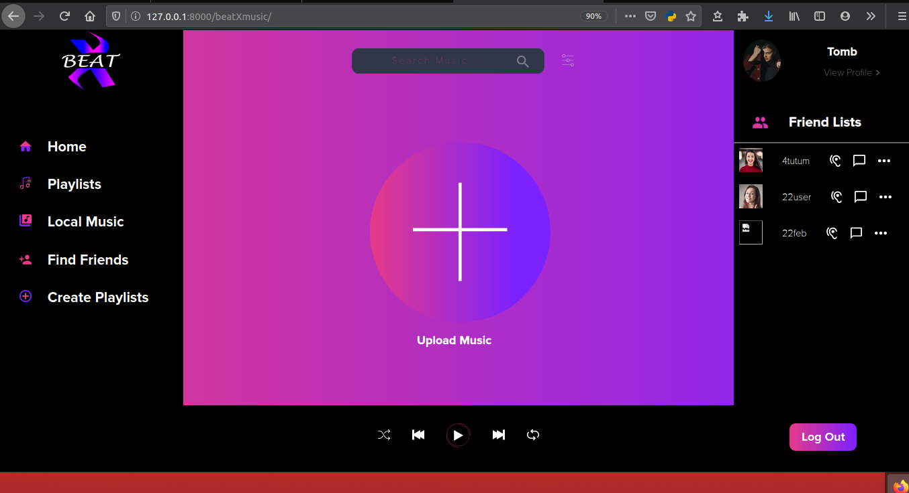

# BeatX-
BeatX is a music streaming social network where users around the globe connect with eachother through music they love to listen.
<br>
Requirement for initial setup: 
 [Install python3 from here.](https://www.python.org/downloads/)
<p>
and pip:<br>
        asgiref           3.2.3<br>
        deprecation       2.0.7<br>
        Django            3.0.2<br>
        django-filter     2.2.0<br>
        eyeD3             0.9<br>
        filetype          1.0.5<br>
        mutagen           1.43.0<br>
        packaging         20.1<br>
        Pillow            7.0.0<br>
        pip               19.3.1<br>
        pydub             0.23.1<br>
        pyparsing         2.4.6<br>
        python-vlc        3.0.7110<br>
        pytz              2019.3<br>
        setuptools        41.2.0<br>
        six               1.14.0<br>
        SpeechRecognition 3.8.1<br>
        sqlparse          0.3.0<br>
        stagger           1.0.0<br>
        style             1.1.0<br>
        tinytag           1.2.2<br>

</p>
<p>
<h1>Api Documentation:</h1>
     ```for get/post request: use the root/path/songs```<br>
     ```for put/delete/get by id: use root/path/songs/<int:pk>```<br>
     ```for pagination:<br>
     pagenumber=refers to the page number<br> 
     pagesize = refers to page size<br>
        and the url: root/path/songs/pagenumber=<int:pk>/pagezie=<int:size></p>```<br>
